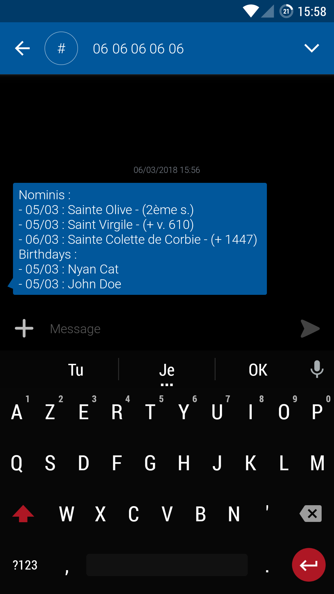
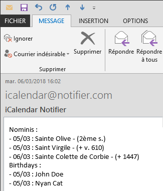
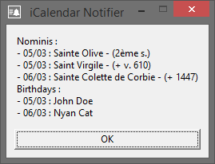

# iCalendar Notifier

## About
My overkill but yet powerful and fully configurable Python solution for birthday reminder : Sound, graphical pop-up, e-mail and/or SMS notifications using [Free Mobile](http://mobile.free.fr/) SMS API for [iCalendar](https://en.wikipedia.org/wiki/ICalendar) .ics files or [Webcal](https://en.wikipedia.org/wiki/Webcal) URLs calendars events. 

Use it with your [friends' birthdays Facebook Webcal](https://www.facebook.com/help/152652248136178?helpref=uf_permalink), your [Nextcloud](https://nextcloud.com/)'s birthdays calendar generated from your contacts list, ...

| SMS notification | E-mail notification | Graphical pop-up |
|:-:|:-:|:-:|
|  |  |  |

## Usage
Run `icalendar_notifier.py` with a `config.ini` file path as `-c` command line argument, for example from a [cron](https://en.wikipedia.org/wiki/Cron) job.  

Crontab every day at 8am ? There you go :
```
0 8 * * * cd /SCRIPT_PATH/ && /usr/bin/python3 /SCRIPT_PATH/icalendar_notifier.py -c /CONFIG_PATH/config.ini
```
:warning: The `cd /SCRIPT_PATH/` command from the example above is **MANDATORY** in a cron job if you want to use relative paths in your `config.ini` configuration file. You are welcome.

## Requirements
- [Python 3](https://www.python.org/)
  - [icalendar](https://github.com/collective/icalendar)

## Configuration
Edit the provided `config.ini` configuration file to set up the script. Everything is properly commented, easy peasy !

```ini
[General]
; Enable future events
get_notified_in_advance = True
; How many days in the future
days_before_notification = 1
; How many retries in case of connection issue
retry_attempts_if_failure = 10
; Pause in seconds between each retry
time_before_retry_in_seconds = 10

[Logging]
; Enable logging in file
logging = True
; Path to log file
log_file = ./activity.log
; Maximum size of log file in octets
log_size_in_octets = 1000000

[Directories]
; Cache directory path for webcal files
cache_directory = ./calendars/
; Built-in external modules directory path
modules_directory = ./dependencies/
; Folder, .ics file paths and/or webcal URLs, comma separated
urls_and_paths_to_check = ./calendars/,/home/calendars/birthdays.ics,webcal://nominis.cef.fr/ical/nominis.php

[SMS_Notifications]
; Enable SMS notifications using Free Mobile SMS API
sms_notifications = False
; Your Free Mobile SMS API username
free_mobile_user = XXXXXXXX
; Your Free Mobile SMS API password
free_mobile_password = XXXXXXXXXXXXXX

[Sound_Notifications]
; Enable sound notifications
sound_notifications = False
; Sound file path, .wav format
sound_file = ./ressources/notification.wav

[Email_Notifications]
; Enable e-mail notifications
email_notifications = False
; SMTP server address
smtp_server = smtp.free.fr
; Subject of e-mail notification
email_subject = iCalendar Notifier
; Sender e-mail address
email_sender = icalendar@notifier.com
; Recipients e-mail addresses, comma separated
email_recipients = user@gmail.com,jdoe@somewhere.org

[MessageBox_Notifications]
; Enable pop-up notifications
messagebox_notifications = True
; Enable topmost pop-up Windows
jump_to_the_front = True
; Icon file path, .pgm format
icon_file = ./ressources/notification.pgm
```

## Todo
- Recurrence rule (`RRULE` property) handling
  
## License
iCalendar Notifier is released under the [GNU General Public License v3.0](https://www.gnu.org/licenses/gpl-3.0.fr.html).
